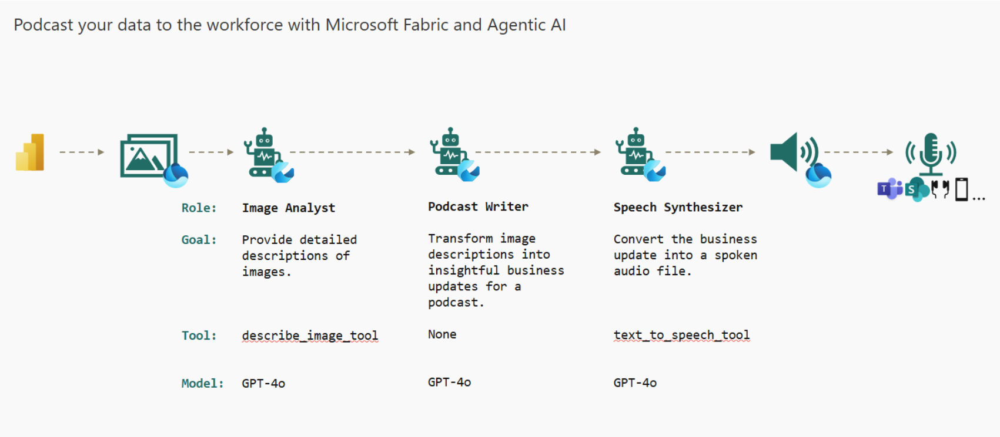

The objective of this solution is to convert an existing Power BI report into an engaging audio content by utilizing a multi-agent workflow.

# Prerequisites for the end to end solution
- Microsoft Power BI to create a report that will be converted into a podcast
- Microsoft Fabric to provide storage and compute via its Lakehouse and Python notebooks capabilities
- Azure AI Foundry to deploy Azure OpenAI models that will power the agents
- Azure AI Speech Service to convert text to speech and create audio files
- Azure Data Lake Storage Gen2 to provide the landing zone for files
- Microsoft 365 Subscription to access SharePoint and Teams as a content consumption channels
- Logic Apps (PaaS approach)/Power Automate (SaaS approach) to automate interactions between Fabric and Microsoft 365

# Edit the env file to add the following variables
- MY_AZURE_OPENAI_ENDPOINT= <insert your azure openai endpoint>
- AZURE_OPENAI_MODEL_DEPLOYMENT= <insert you azure openai model deployment name>
- AZURE_OPENAI_KEY=<insert your azure openai key>
- AZURE_OPENAI_API_VERSION=<inset your azure openai api version>
- AZURE_SPEECH_KEY=<insert your azure speech key>
- AZURE_SPEECH_REGION=<insert your azure speech region> 

# Highlevel Solution Overview
